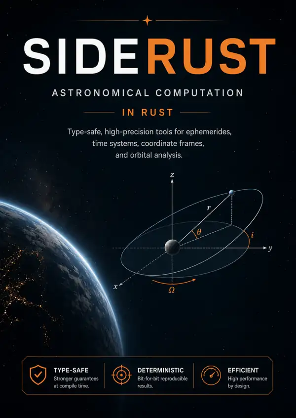
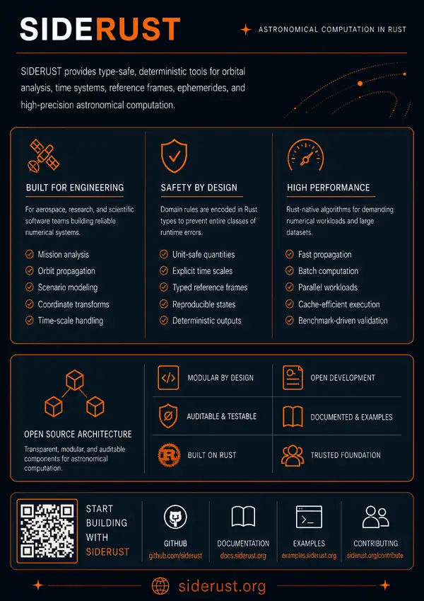

# Siderust brochure

A two-sided visual overview of Siderust and its focus on type-safe, deterministic astronomical computation in Rust.

Project page: https://vpramon.github.io/projects/siderust

## Front

## Back

The brochure artwork is stored as web-optimized WebP assets to keep the repository footprint small.
